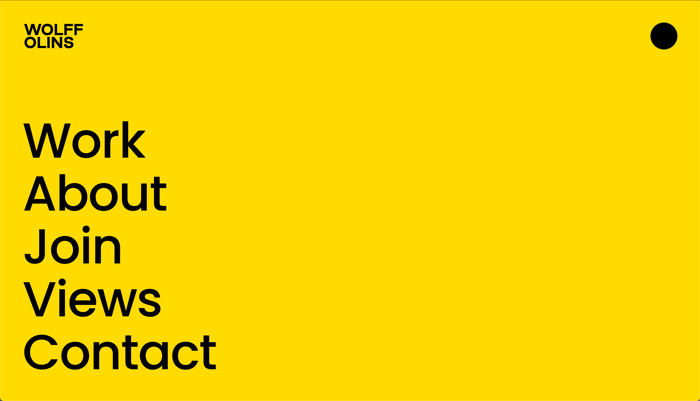

This is a [Next.js](https://nextjs.org/) project bootstrapped with
[`create-next-app`](https://github.com/vercel/next.js/tree/canary/packages/create-next-app).

## Getting Started

First, run the development server:

```bash
npm run dev
# or
yarn dev
# or
pnpm dev
```

Open [http://localhost:3000](http://localhost:3000) with your browser to see the result.

You can start editing the page by modifying `pages/index.js`. The page auto-updates as you edit the file.

[API routes](https://nextjs.org/docs/api-routes/introduction) can be accessed on [http://localhost:3000/api/hello](http://localhost:3000/api/hello). This endpoint can be edited in `pages/api/hello.js`.

The `pages/api` directory is mapped to `/api/*`. Files in this directory are treated as [API routes](https://nextjs.org/docs/api-routes/introduction) instead of React pages.

This project uses [`next/font`](https://nextjs.org/docs/basic-features/font-optimization) to automatically optimize and load Inter, a custom Google Font.

## Learn More

To learn more about Next.js, take a look at the following resources:

- [Next.js Documentation](https://nextjs.org/docs) - learn about Next.js features and API.
- [Learn Next.js](https://nextjs.org/learn) - an interactive Next.js tutorial.

You can check out [the Next.js GitHub repository](https://github.com/vercel/next.js/) - your feedback and contributions are welcome!

## Deploy on Vercel

The easiest way to deploy your Next.js app is to use the [Vercel Platform](https://vercel.com/new?utm_medium=default-template&filter=next.js&utm_source=create-next-app&utm_campaign=create-next-app-readme) from the creators of Next.js.

Check out our [Next.js deployment documentation](https://nextjs.org/docs/deployment) for more details.

## Roadmap

List of things to be implemented:

- [X] Choose font (or fonts) to be used - [Plus Jakarta Sans](https://fonts.google.com/specimen/Plus+Jakarta+Sans?query=Jakarta)
- [X] Define colorscheme to be used throughout the website - [Japandi](inspiration/japandi_colorscheme.jpeg)
	- Update on 2023-04-27 : I've decided to use something simpler with just 4 colors.
- [X] Customize Tailwind's theme with colorscheme colors - [TailwindCSS: Adding Custom Styles](https://tailwindcss.com/docs/adding-custom-styles)
- [ ] Update colorscheme (again) to the one in [this page](https://manonjouet.com/projects/mojo).
- [ ] Setup `/sketches` page
- [ ] Setup `/sketches/[id]` page so that each identifier maps to a specific .js page containing the sketch to be displayed
- [ ] Setup `/posts` page
- [ ] Setup `/posts/[id]` page so that each identifier maps to a Markdown file containing the post's content
	- Double check we're able to render images this way
- [ ] Try to use React in order to creat inputs to control variables in some of the sketches, in favour of using Tweakpane
	- Try reading up on [useRef](https://react.dev/reference/react/useRef).
- [ ] Use shapes for each of the website's section, for example, square for the "Posts", circle for the "Sketches", etc.
	- [Some inspiration](https://www.creativeboom.com/uploads/articles/0f/0f4e193ba9164073646e67421eb37b4b26986c67_1620.png).

### Inspiration


